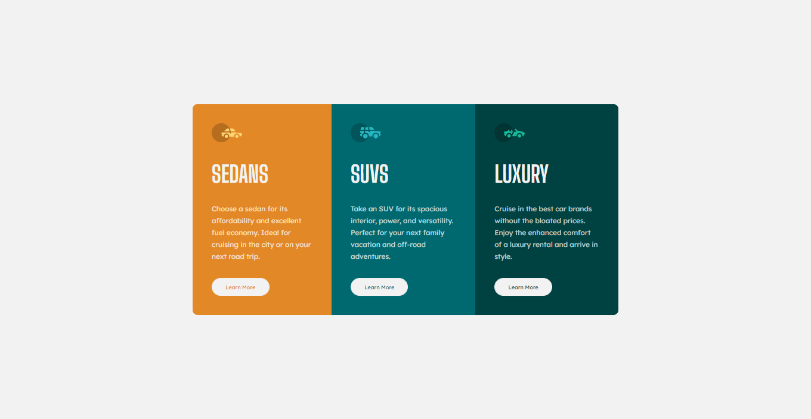

# Frontend Mentor - 3-column preview card component solution

This is a solution to the [3-column preview card component challenge on Frontend Mentor](https://www.frontendmentor.io/challenges/3column-preview-card-component-pH92eAR2-). Frontend Mentor challenges helps me improve my coding skills by building realistic projects. 

## Table of contents

- [Overview](#overview)
  - [The challenge](#the-challenge)
  - [Screenshot](#screenshot)
  - [Links](#links)
- [My process](#my-process)
  - [Built with](#built-with)
  - [What I learned](#what-i-learned)
  - [Continued development](#continued-development)
  - [Useful resources](#useful-resources)
- [Author](#author)
- [Acknowledgments](#acknowledgments)

## Overview

### The challenge

Users should be able to:

- View the optimal layout depending on their device's screen size
- See hover states for interactive elements

### Screenshot

### Links

- Solution URL: [Add solution URL here](https://your-solution-url.com)
- Live Site URL: [Add live site URL here](https://your-live-site-url.com)

## My process

### Built with

- HTML5
- CSS custom properties
- Flexbox
- Mobile-first workflow

### What I learned

More practice using Flexbox. I learned best practices when using Media Queries.

### Continued development

Upon completion, I realized that maybe it would be easier to create this project using SASS. 

### Useful resources

- [Flexbox in 20 minutes](https://www.youtube.com/watch?v=JJSoEo8JSnc&t=719s&ab_channel=TraversyMedia) - My go to video when I need a quick refresher on Flexbox
- [Media Queries Not Working: Stack Overflow](https://stackoverflow.com/questions/26888751/chrome-device-mode-emulation-media-queries-not-working) - Media Queries were not working when I was using the Chrome Developer tools. This post helped me. 

## Author

- Frontend Mentor -  [@zencoder24](https://www.frontendmentor.io/profile/zencoder24)

